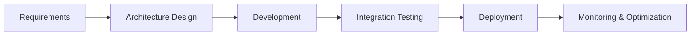
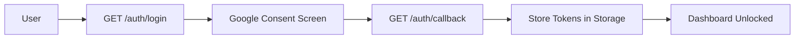
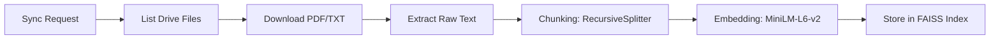
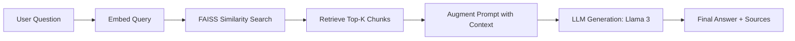
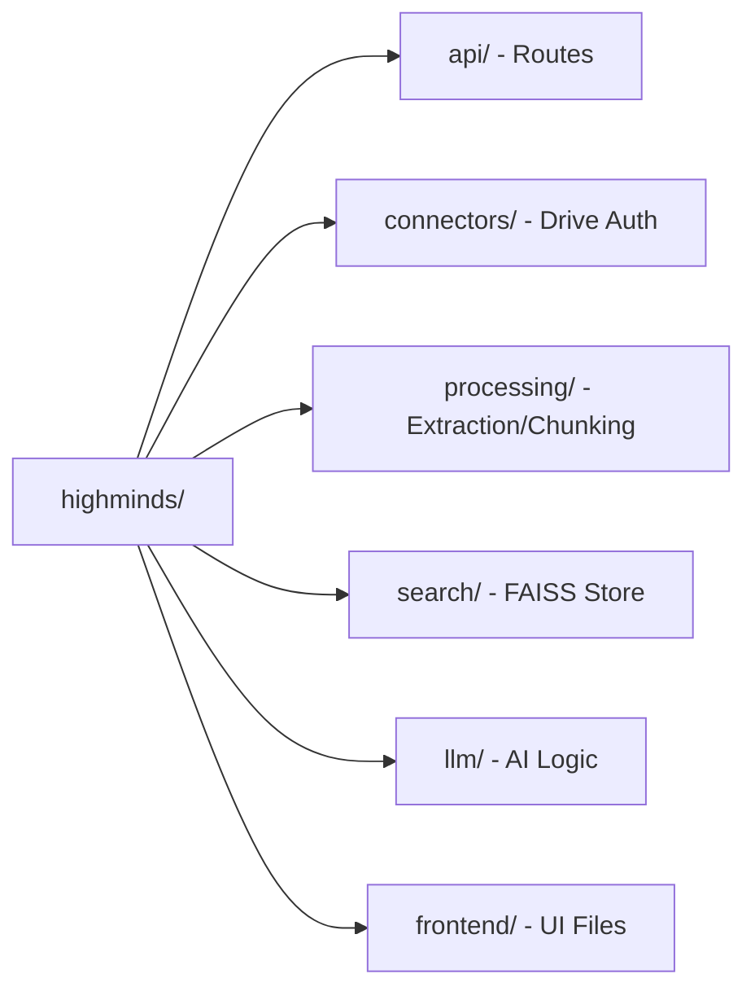

# Project Workflow — Highwatch AI

This document outlines the operational and development workflows for the Highwatch AI RAG System.

---

## 1. System SDLC Workflow
The standard development lifecycle followed for this project.

---

## 2. Authentication Flow (Google OAuth 2.0)
How the user connects their Google Drive to the system.

---

## 3. Data Ingestion & Sync Workflow
The process of transforming raw Drive files into searchable vector embeddings.

---

## 4. Retrieval-Augmented Generation (RAG) Flow
How the AI answers questions based on the synced documents.

---

## 5. Directory Structure Overview
Horizontal view of the project architecture.

